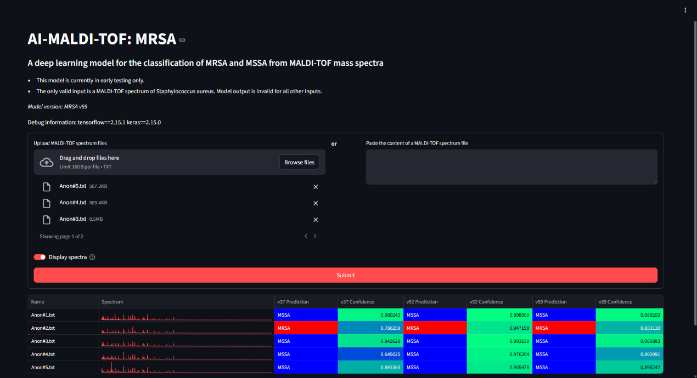

This directory contains the source code for the website used in prospective testing to access the deployed machine learning model.

During prospective testing, this website is deployed on a private server where spectrum files can be uploaded and analyzed using the trained model. The results for all three models are immediately displayed on the website after submission. The submitted files are not stored on the server to ensure data privacy.

Screenshot of the website using dummy spectrum files for demonstration.